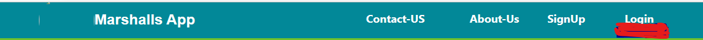
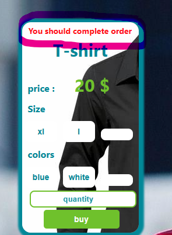
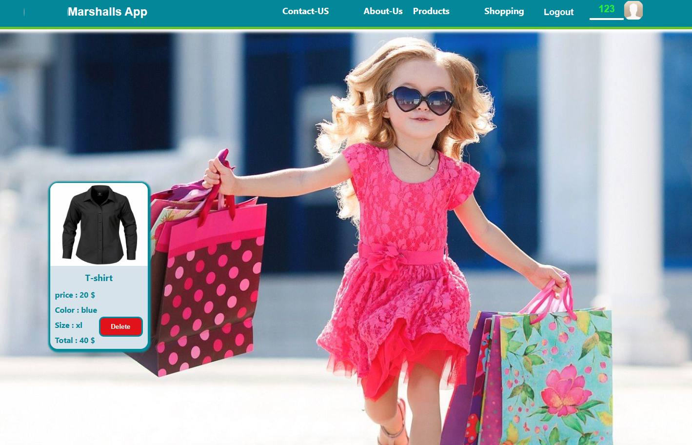
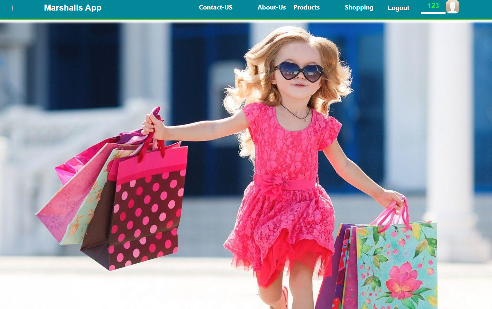
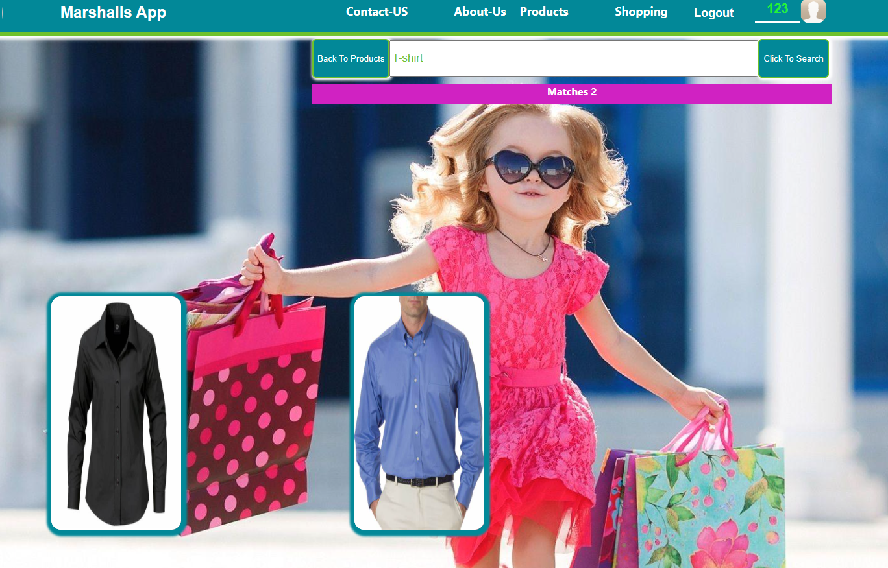
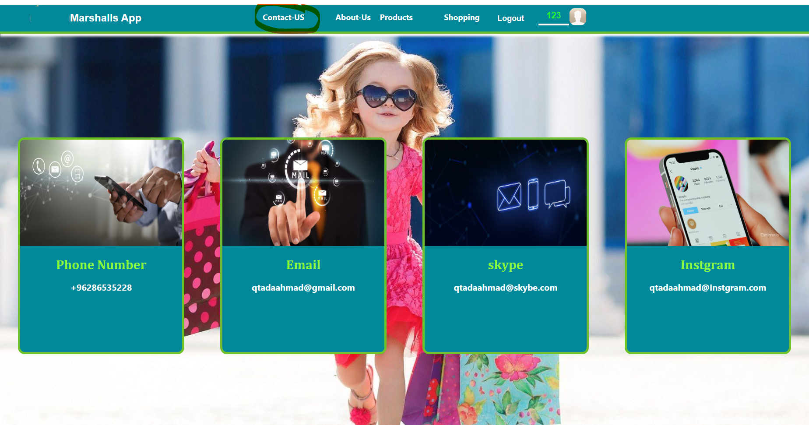
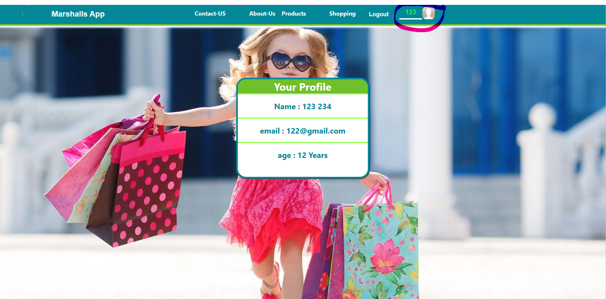
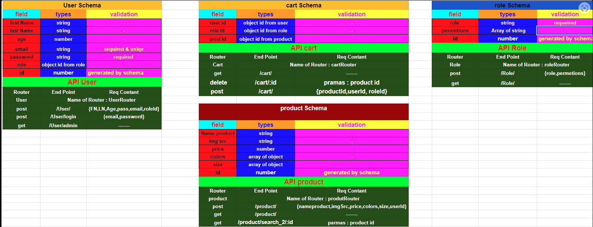

<p align="center">
 
</p>

<h3 align="center">Marshalls APP
</h3>

---

## 📝 Table of Contents

- [About](#about)
- [Getting Started](#getting_started)
- [Usage](#usage)
- [Built Using](#built_using)
- [User Story](#user_story)
- [Data Flow](#data_flow)
- [Guided By](#guided_by)

## 🧐 About <a name = "about"></a>

We aim in this commercial site to make life easier for the customer and make the market reach his home instead of enduring the hardship of the road and going to the market. On this site, you can reach any product related to clothing, whatever its type, winter or summer. In it and quite easily, you only have to log in to the site and you will get the best clothes.

## 🏁 Getting Started <a name = "getting_started"></a>

These instructions will get you a copy of the project up and running on your local machine for development and testing purposes.

### Prerequisites

- Visual Studio Code follow this <a href='https://visualstudio.microsoft.com/downloads/'>link</a> to install.
- Git Bash follow this <a href='https://git-scm.com/downloads'>link</a> to install.
- MongoDB follow this <a href='https://www.mongodb.com/try/download/community'>link</a> to install.
- Node.js follow this <a href='https://nodejs.org/en/download'>link</a> to install.

### Installing

1. Clone the repo to your local machine using git bash.

```
git clone https://github.com/C8-QtadaAlBalwe/MERAKI_Academy_Project_4.git
```

2. Install packeges repeat this step in backend and frontend folder

```
npm i
```

3. Run server using git bash inside backend folder

```
npm run dev
```

4. Run application using git bash inside frontend folder

```
npm start
```

Now app ready to use


## 🎈 Usage <a name="usage"></a>

- First: You must create your own account on the site.


- Note: If you had a previous account, you can click on the log in from the bar above, and this image will appear for you.




---

- Second: When the first stage is completed, the products page will appear.


- Third: Now we will shop according to the product you want. We will start by clicking on the product we want to buy, and for example it will be like the one in the picture.


Now you can specify the color, size and quantity

- So, after choosing all the specifications, we say click on the buy button
Note: If any of the product specifications is missing, a message will appear to you: “You must complete your order completely.” You must complete it and click on the buy button.



- Fourth: Here, after clicking on the purchase button, the product has been added to the shopping cart, so that the product appears in it with the full specifications that you have chosen and the total price of each commodity




- Note: Here the site allows you to delete the product if you change your mind so that you click on the delete button and the product will be deleted





-Through the top bar, it is possible to navigate from the product description to the shopping cart page


- In the event that you want to search for a specific product, all you have to do is fill in the product name correctly and click on the search button




- If you want to return to all products, just click on the Back to Products button
​Look up details


- In case you want to read about our site gives you the option in the top bar that


- And if you encounter specific problems, you can contact us through the option also located on the top bar.




- You can also check your account information by clicking on the profile picture and your account information will appear




- After completing your shopping, you can log out of the site through the option in the top bar


---
## ⛏️ Built Using <a name = "built_using"></a>


- [MongoDB](https://www.mongodb.com/) - Database
- [Express JS](https://expressjs.com/) - Server Framework
- [React JS](https://https://reactjs.org/) - Web Framework
- [Node JS](https://nodejs.org/en/) - Server Environment

## User Story <a name = "#user_story"></a


 MY trello board link

<a href='https://trello.com/b/7oozLqkw/project4'>Trello</a>


## Data Flow <a name = "#data_flow"></a>


</a>


## ⚠️ Guided By <a name = "guided_by"></a>


This project is guided by ©️ **[MERAKI Academy](https://www.meraki-academy.org)**
